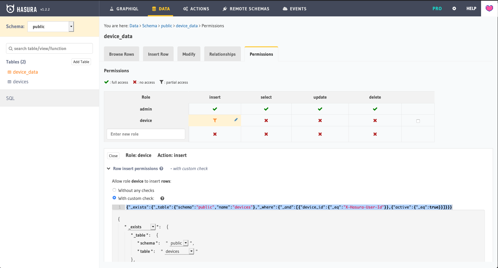

hasura-connect
==============

Hasura connector with MQTT
hasura-connect cli helps us to connect MQTT broker with hasura graphql engine securely just with 2 commands.

Currently this project supports [eclipse-sparkplug ](https://www.eclipse.org/tahu/spec/Sparkplug%20Topic%20Namespace%20and%20State%20ManagementV2.2-with%20appendix%20B%20format%20-%20Eclipse.pdf) payload specification only.


[](https://oclif.io)
[](https://npmjs.org/package/hasura-connect)
[](https://npmjs.org/package/hasura-connect)
[](https://github.com/soorajshankar/hasura-connect/blob/master/package.json)

<!-- toc -->
* [Usage](#usage)
* [Commands](#commands)
<!-- tocstop -->
# Usage
<!-- usage -->
```sh-session
$ npm install -g hasura-connect
$ hasura-connect COMMAND
running command...
$ hasura-connect (-v|--version|version)
hasura-connect/0.1.0 darwin-x64 node-v14.2.0
$ hasura-connect --help [COMMAND]
USAGE
  $ hasura-connect COMMAND
...
```
<!-- usagestop -->
# Commands
<!-- commands -->
<!-- * [`hasura-connect help [COMMAND]`](#hasura-connect-help-command) -->
* [`hasura-connect init`](#hasura-connect-init)
* [`hasura-connect connect`](#hasura-connect-connect)

## `hasura-connect init`
Create a folder where you want to configure hasura connect, and run the following.

Describe the command here

```
USAGE
  $ hasura-connect init

```

DESCRIPTION
This will create a configuration file `config.json` in the current directory with the default configuration.
```json
{
  "HASURA_HOST":"http://localhost:8080",
  "MQTT_HOST":"http://127.0.0.1:1883"
}
```
This can be further edited by the user.

_See code: [src/commands/init.js](https://github.com/soorajshankar/hasura-connect/blob/v0.1.0/src/commands/init.js)_

## `hasura-connect connect`

This will connect start subscribing to the MQTT broker (currently accepts sparkplug payloads only).

Describe the command here

```
USAGE
  $ hasura-connect connect

OPTIONS
  -n, --name=name  name to print

DESCRIPTION
  ...
  Extra documentation goes here
```

_See code: [src/commands/connect.js](https://github.com/soorajshankar/hasura-connect/blob/v0.1.0/src/commands/connect.js)_

# Configuring Hasura GraphQL Engine.

## Setting up the DB

This project currently support only one Mutation (insert_device_data). 
To setup the table 
* Go to Hasura Console > Data > SQL 
* Run & Track the following SQL to create a table and setup the mutation

```sql
CREATE TABLE "public"."device_data"("id" serial NOT NULL, "data" jsonb NOT NULL, "timestamp" timestamptz NOT NULL, "device_id" text NOT NULL, PRIMARY KEY ("id") );
```

## Authorization
Considering we use mutations, set of headers we pass is as follows
```
      "X-Hasura-Role": "device",
      "X-Hasura-User-Id": <device_id>,
```
`device_id`: Used here is directly parsed from the sparkplug topic.

So any custom permissions can be set on the hasura cloud with a role `device`. We recommend to use any of the following approaches.
<!-- toc -->
* [Allow from all device](#Allow-from-all-device)
* [Allow only from Registered devices](#Allow-only-from-Registered-devices)
<!-- tocstop -->

### Allow from all device

Following permission will allow `hasura-connect` to make mutation from any device_id.


### Allow only from Registered devices

For doing this, we need to create one more table to store the information of registered devices. This will ensure that Hasura allows the mutations only from the registered devices.
* Run & Track the following SQL 
```sql
CREATE TABLE "public"."devices"("id" serial NOT NULL, "device_id" text NOT NULL, "active" boolean NOT NULL DEFAULT true, PRIMARY KEY ("id") );
```

* Add device information to the newly created table.
* Setup Permissions for `device_data` insert.

```json
{"_exists":{"_table":{"schema":"public","name":"devices"},"_where":{"_and":[{"device_id":{"_eq":"X-Hasura-User-Id"}},{"active":{"_eq":true}}]}}}
```



Above permission will make sure that the mutation is only allowed if the device is registered in the devices table.

<!-- ## `hasura-connect help [COMMAND]`

display help for hasura-connect

```
USAGE
  $ hasura-connect help [COMMAND]

ARGUMENTS
  COMMAND  command to show help for

OPTIONS
  --all  see all commands in CLI
```

_See code: [@oclif/plugin-help](https://github.com/oclif/plugin-help/blob/v3.1.0/src/commands/help.ts)_ -->

<!-- commandsstop -->

# Roadmap

- [ ] More configurations
- [ ] Support other streams (Apache Kafka, Apache NiFi, Other MQs, SNS, GCM etc.)
- [ ] Batch mutaions for better performance
- [ ] support custom MQTT payload spec
- [ ] make a Demo app (a digital twin/ realtime chart :?)
- [ ] Performance test & optimisation