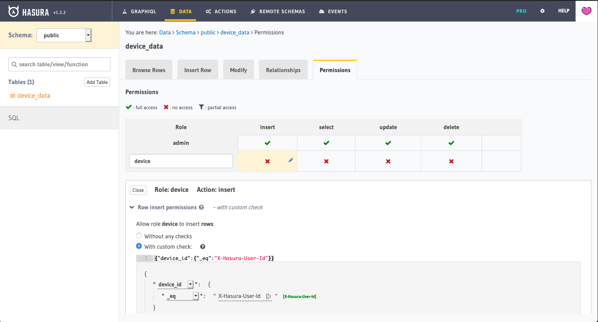

# hasura-connect

Hasura connector with MQTT
hasura-connect cli helps us to connect MQTT broker with hasura graphql engine securely just with 2 commands.

Currently this project supports [eclipse-sparkplug ](https://www.eclipse.org/tahu/spec/Sparkplug%20Topic%20Namespace%20and%20State%20ManagementV2.2-with%20appendix%20B%20format%20-%20Eclipse.pdf) payload specification only.

[](https://oclif.io)
[](https://npmjs.org/package/hasura-connect)
[](https://npmjs.org/package/hasura-connect)
[](https://github.com/soorajshankar/hasura-connect/blob/master/package.json)

<!-- toc -->
* [hasura-connect](#hasura-connect)
* [Usage](#usage)
* [Commands](#commands)
* [Configuring Hasura GraphQL Engine.](#configuring-hasura-graphql-engine)
* [Roadmap](#roadmap)
<!-- tocstop -->

### Allow from all device

Following permission will allow `hasura-connect` to make mutation from any device_id.



### Allow only from Registered devices

For doing this, we need to create one more table to store the information of registered devices. This will ensure that Hasura allows the mutations only from the registered devices.

-   Run & Track the following SQL

```sql
CREATE TABLE "public"."devices"("id" serial NOT NULL, "device_id" text NOT NULL, "active" boolean NOT NULL DEFAULT true, PRIMARY KEY ("id") );
```

-   Add device information to the newly created table.
-   Setup Permissions for `device_data` insert.

```json
{
	"_exists": {
		"_table": { "schema": "public", "name": "devices" },
		"_where": {
			"_and": [
				{ "device_id": { "_eq": "X-Hasura-User-Id" } },
				{ "active": { "_eq": true } }
			]
		}
	}
}
```


Above permission will make sure that the mutation is only allowed if the device is registered in the devices table.

# Roadmap

-   [ ] More configurations
-   [ ] Support other streams (Apache Kafka, Apache NiFi, Other MQs, SNS, GCM etc.)
-   [ ] Batch mutaions for better performance
-   [ ] support custom MQTT payload spec
-   [ ] make a Demo app (a digital twin/ realtime chart :?)
-   [ ] Performance test & optimisation
